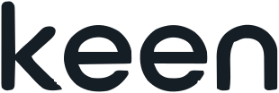
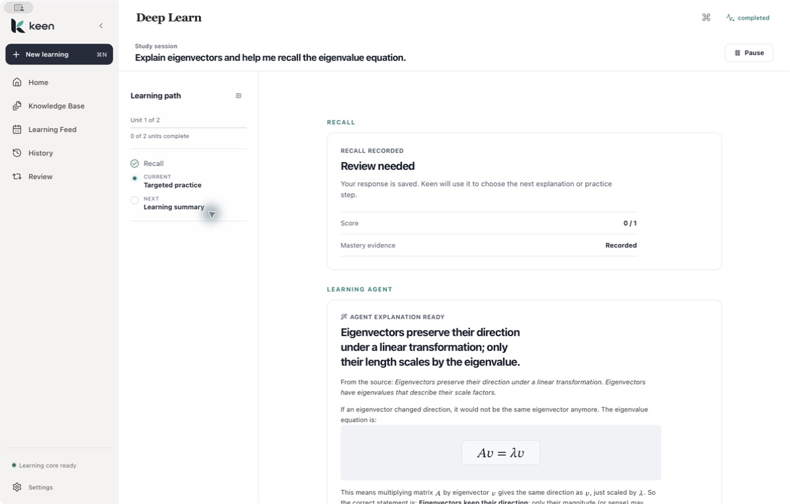
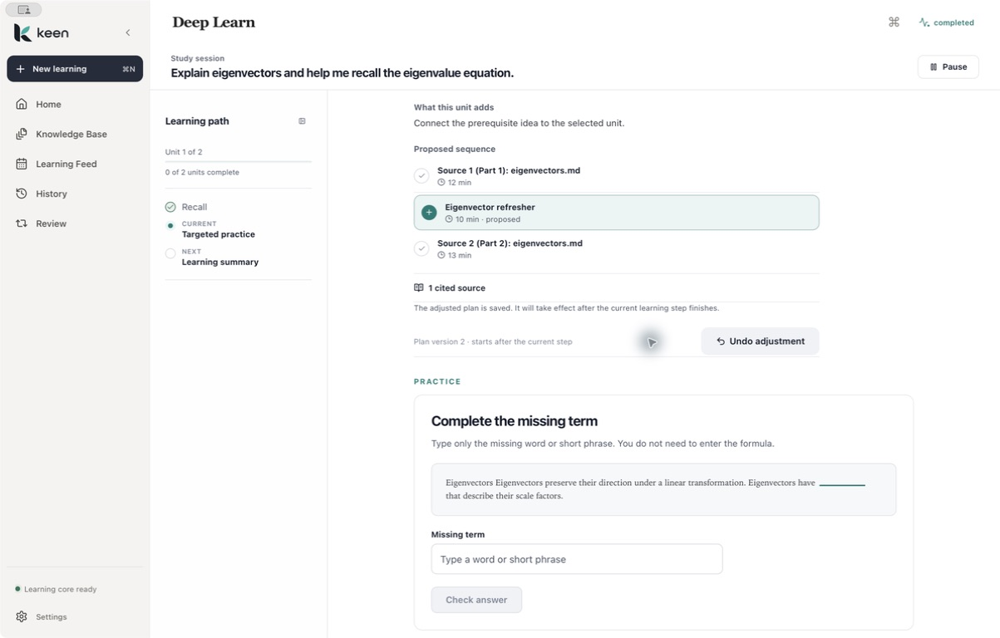
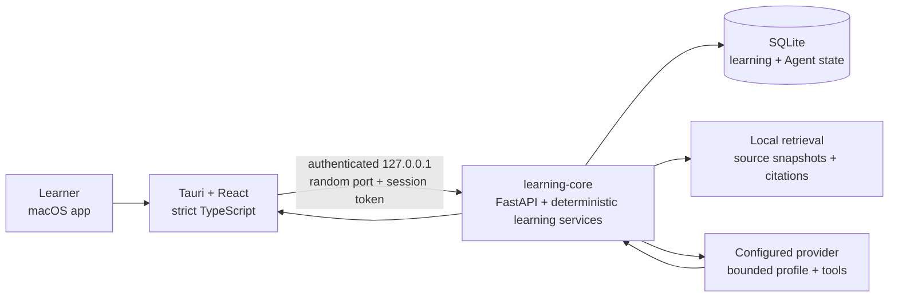

<p align="center">
  
</p>

<p align="center">
  <strong>A local-first learning Agent that adapts your study path only when
  your learning evidence supports it.</strong>
</p>

<p align="center">
  Bring your own material. Keen builds the route, notices when the first
  approach fails, and proposes what to try next.
</p>

<p align="center">
  <a href="docs/PRODUCT_CASE_STUDY.md">Product case study</a> ·
  <a href="docs/PORTFOLIO_DEMO.md">3-minute walkthrough</a> ·
  <a href="docs/INSTALL_MACOS.md">Install local Alpha</a> ·
  <a href="docs/AGENT_NATIVE_ARCHITECTURE.md">Agent design</a> ·
  <a href="docs/IMPLEMENTATION_PLAN.md">Implementation status</a>
</p>

<p align="center">
  
</p>

<p align="center">
  <sub><em>A missed Recall becomes a source-grounded intervention—not a hidden mastery update.</em></sub>
</p>

---

## What is Keen, really?

Keen is a local-first macOS study workspace for people learning a bounded
subject from their own material.

You give it a course, a source, and a goal. Keen builds a visible path, guides
you through explanation and Recall, follows with targeted Practice, schedules
Review, and remembers exactly where to continue after the app closes.

The model writes explanations and bounded proposals. Keen owns the learning
state.

## When the first explanation fails

A learner imports a chapter on eigenvectors and asks Keen to help them
understand the eigenvalue equation.

They read the first unit, answer Recall, and get it wrong. Keen does not call
the lesson “complete,” generate a score from model intuition, or ask the
learner to write a better prompt. It combines three saved facts: the learner's
opening confidence, the deterministic Recall result, and a validated
source-grounded intervention.

The Learning Agent explains the idea another way, then proposes one
prerequisite before the next unstarted unit. The learner sees why it appeared,
which source supports it, and what the sequence would become. They can Accept
or Keep the current path.

Accepting appends plan version 2. The learner completes Practice, closes Keen,
and later resumes the inserted unit from Feed or History—without another
provider run.

## A learning loop that can adapt

```text
your material
→ one learning goal
→ visible study path
→ explanation
→ Recall
→ deterministic evaluation
→ source-grounded help
→ Practice
→ Review
→ one persisted next action
```

Keen keeps generation and learning evidence separate. Reading a fluent answer
does not count as mastery. The next independent attempt does.

## How the Agent loop works

Keen connects generation to a visible trigger, exact learning context, bounded
tools, validated artifacts, learner approval, versioned changes, Undo, and
recovery.

```text
Observe saved learning evidence
→ choose one bounded action in host code
→ assemble the exact Session and source scope
→ run the configured provider
→ validate the artifact and source handles
→ ask the learner before changing the plan
→ append a plan version
→ return to Practice
→ recover after restart
```

| Provider contribution | Keen-owned learning state |
| --- | --- |
| Explain a concept from allowed source excerpts | Deterministic Recall evaluation |
| Produce a contract-validated intervention artifact | Mastery, BKT, and FSRS updates |
| Propose one source-linked prerequisite | Completion and Review scheduling |
| Suggest a visible plan diff | Learner-approved plan application |

<p align="center">
  
</p>

<p align="center">
  <sub><em>The accepted prerequisite becomes plan version 2 and keeps a bounded Undo.</em></sub>
</p>

## What you can do in Keen

| Capability | Experience |
| --- | --- |
| Build a course workspace | Import PDF, Markdown, and text sources into a local knowledge base |
| Ask from your material | Keep answers scoped to the course and inspect their citations |
| Start focused Study | Turn one learning goal into a visible, multi-unit path |
| Learn actively | Move through reflection, explanation, Recall, Practice, and Summary |
| Get timely help | Receive a source-grounded alternate explanation after a difficult Recall |
| Adapt the path | Review, accept, keep, or undo a bounded prerequisite proposal |
| Return at the right time | Add completed work to an FSRS Review queue |
| Continue across sessions | Resume the same next action from Home, Feed, History, or Review |
| Choose your model | Configure a local or remote provider from native Settings |

## Product decisions behind Keen

My contribution centered on product strategy, interaction architecture, Agent
boundaries, acceptance criteria, implementation orchestration, and native
product review. Model-assisted engineering accelerated execution; the product
decisions and acceptance gates remained human-owned.

The work came down to four choices:

- narrow a broad “learning OS” into one source-to-Review loop;
- keep the Agent inside Deep Learn, not in a dashboard or persona;
- require learner approval for every plan change;
- keep evaluation, scheduling, progress, and recovery deterministic.

The longer product story is in **[Designing Keen: from “AI study assistant” to
a learning Agent](docs/PRODUCT_CASE_STUDY.md)**.

## Architecture



The architecture keeps three responsibilities separate:

- **React/Tauri** owns the native interaction and validated process boundary.
- **Learning-core** owns the learning loop and its durable state.
- **The provider** returns bounded explanation or proposal artifacts.

Read the full [Agent-native architecture](docs/AGENT_NATIVE_ARCHITECTURE.md)
or the [learning-core service contract](services/learning-core/README.md).

## Verification

The current portfolio acceptance includes 48 desktop test files / 563 tests,
strict TypeScript and zero-warning ESLint, 1,155 Python tests, 50 Rust tests,
the production Tauri app plus bundled-sidecar smoke, and one native DeepSeek
Recall → Agent → Accept → Practice journey that survives a full restart
without duplicate runs.

Exact commands and acceptance artifacts are kept in
[`docs/IMPLEMENTATION_PLAN.md`](docs/IMPLEMENTATION_PLAN.md) and
[`artifacts/orchestrator/final-portfolio-acceptance/acceptance.md`](artifacts/orchestrator/final-portfolio-acceptance/acceptance.md).

## Quick start

### Browser Demo

The browser build is deterministic and does not call a provider.

```bash
npm ci
npm run dev
```

Open `http://127.0.0.1:1430`.

### Native macOS development

Requirements: macOS 14+, Node.js 20+, Rust stable, and Python 3.11–3.14.

```bash
source "$HOME/.cargo/env"
npm ci
python3.11 -m venv .venv
.venv/bin/python -m pip install -e 'services/learning-core[dev]'
npm run tauri -- dev
```

Tauri supervises the local learning-core process and shuts the full process
group down with the app. Provider setup lives in native **Settings → Model**.

### Configure a model

Open **Settings → Model**, choose a provider, enter the exact model ID and API
key, then choose **Save and verify**. Keen stores remote keys in macOS Keychain,
restarts the local learning service, and reports saving, restart, and connection
verification as separate states.

The current catalog includes Ollama and OpenAI plus convenience mappings for
DeepSeek, Anthropic Claude, Google Gemini, OpenRouter, Groq, Mistral, xAI,
Qwen, and Kimi. A Custom API base covers another OpenAI-compatible endpoint.
The catalog owns each known API base; Custom expects a base URL rather than a
final `/chat/completions` resource.

Each preset configures the corresponding transport and API base. **Save and
verify** checks the selected key, account, region, model ID, and provider API
before Keen begins a learning run.

See [Install Keen on macOS](docs/INSTALL_MACOS.md) for the current local-Alpha
installation, first-provider, first-learning, and recovery flow.

## Repository map

```text
apps/desktop/            macOS client: Tauri 2 + React
packages/api-client/     Zod-validated loopback contracts
packages/design-tokens/  Keen visual system
packages/ui/             shared UI primitives
services/learning-core/  learning, retrieval, Agent runtime, SQLite
docs/                    product decisions, architecture, evidence
```

## Build

```bash
npm run check
npm run package:macos
```

The packaging command produces a locally installable arm64 app and DMG.

Third-party dependencies and provenance are recorded in
[`docs/OPEN_SOURCE_INVENTORY.md`](docs/OPEN_SOURCE_INVENTORY.md),
[`docs/UPSTREAM_PATCHES.md`](docs/UPSTREAM_PATCHES.md), and
[`THIRD_PARTY_NOTICES.md`](THIRD_PARTY_NOTICES.md). Canonical Keen marks are
listed in [`docs/BRAND_ASSETS.md`](docs/BRAND_ASSETS.md).
