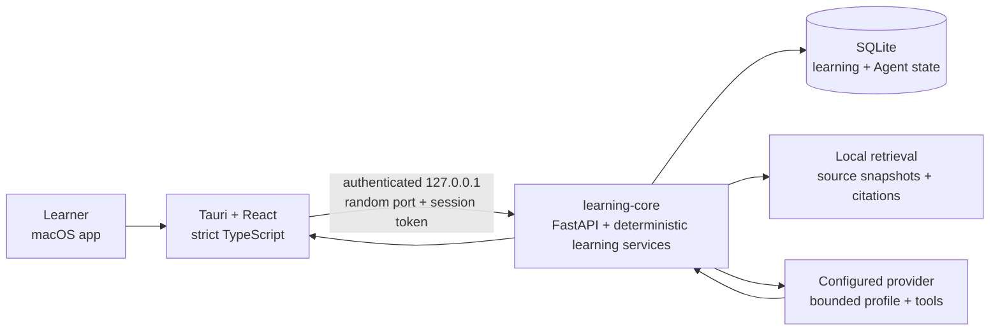

<p align="center">
  
</p>

<p align="center">
  <strong>A local-first learning Agent that adapts your study path only when
  your learning evidence supports it.</strong>
</p>

<p align="center">
  Bring your own material. Keen builds the route, notices when the first
  approach fails, and proposes what to try next.
</p>

<p align="center">
  <a href="docs/PRODUCT_CASE_STUDY.md">Product case study</a> ·
  <a href="docs/PORTFOLIO_DEMO.md">3-minute walkthrough</a> ·
  <a href="docs/INSTALL_MACOS.md">Install local Alpha</a> ·
  <a href="docs/AGENT_NATIVE_ARCHITECTURE.md">Agent design</a> ·
  <a href="docs/IMPLEMENTATION_PLAN.md">Implementation status</a>
</p>

<p align="center">
  
</p>

<p align="center">
  <sub><em>A missed Recall becomes a source-grounded intervention—not a hidden mastery update.</em></sub>
</p>

---

## What is Keen, really?

Keen is a local-first macOS study workspace for people learning a bounded
subject from their own material.

You give it a course, a source, and a goal. Keen builds a visible path, guides
you through explanation and Recall, follows with targeted Practice, schedules
Review, and remembers exactly where to continue after the app closes.

The model writes explanations and bounded proposals. Keen owns the learning
state.

## When the first explanation fails

A learner imports a chapter on eigenvectors and asks Keen to help them
understand the eigenvalue equation.

They read the first unit, answer Recall, and get it wrong. Keen does not call
the lesson “complete,” generate a score from model intuition, or ask the
learner to write a better prompt. It combines three saved facts: the learner's
opening confidence, the deterministic Recall result, and a validated
source-grounded intervention.

The Learning Agent explains the idea another way, then proposes one
prerequisite before the next unstarted unit. The learner sees why it appeared,
which source supports it, and what the sequence would become. They can Accept
or Keep the current path.

Accepting appends plan version 2. The learner completes Practice, closes Keen,
and later resumes the inserted unit from Feed or History—without another
provider run.

## A learning loop that can adapt

```text
your material
→ one learning goal
→ visible study path
→ explanation
→ Recall
→ deterministic evaluation
→ source-grounded help
→ Practice
→ Review
→ one persisted next action
```

Keen keeps generation and learning evidence separate. Reading a fluent answer
does not count as mastery. The next independent attempt does.

## Why this is an Agent, not a chat wrapper

A chat wrapper maps a prompt to text. Keen also owns the trigger, context,
tool boundary, artifact contract, approval, mutation, Undo, and recovery.

```text
Observe saved learning evidence
→ choose one bounded action in host code
→ assemble the exact Session and source scope
→ run the configured provider
→ validate the artifact and source handles
→ ask the learner before changing the plan
→ append a plan version
→ return to Practice
→ recover after restart
```

| The model may | The model may not |
| --- | --- |
| Explain a concept from allowed source excerpts | Decide whether the learner is correct |
| Produce a contract-validated intervention artifact | Write mastery, BKT, or FSRS state |
| Propose one source-linked prerequisite | Mark work complete or schedule Review |
| Suggest a plan diff | Apply it without the learner |

<p align="center">
  
</p>

<p align="center">
  <sub><em>The accepted prerequisite becomes plan version 2 and keeps a bounded Undo.</em></sub>
</p>

## Built and verified today

| Ready to exercise | Deliberately not claimed |
| --- | --- |
| Local course and source creation | Learning efficacy |
| PDF, Markdown, and text ingestion | OCR |
| Source-scoped Ask and focused Study | Open-web research |
| Visible multi-unit learning paths | Broad autonomous curriculum planning |
| Diagnostic, lesson, Recall, Practice, Summary | Model-authored grading or mastery |
| FSRS Review handoff and due queue | Cloud-drive and calendar integrations |
| Provider-backed alternate explanation | Exact reference-product pixel parity |
| Learner-approved plan proposal and Undo | Developer ID signing and notarization |
| Feed, History, and cold recovery | Universal/Intel distribution build |

Keen is a working product slice and a systems case study. It is not yet a
distribution-ready or efficacy-validated product.

## Product decisions behind Keen

My contribution centered on product framing, competitive analysis, interaction
architecture, Agent boundaries, acceptance criteria, implementation
orchestration, and native product review. Model-assisted engineering
accelerated execution; the product decisions and acceptance gates remained
human-owned.

The work came down to four choices:

- narrow a broad “learning OS” into one source-to-Review loop;
- keep the Agent inside Deep Learn, not in a dashboard or persona;
- require learner approval for every plan change;
- keep evaluation, scheduling, progress, and recovery deterministic.

The longer story—including the decisions that were reversed or cut—is in
**[Designing Keen: from “AI study assistant” to a learning
Agent](docs/PRODUCT_CASE_STUDY.md)**.

## Architecture



The architecture keeps three responsibilities separate:

- **React/Tauri** owns the native interaction and validated process boundary.
- **Learning-core** owns the learning loop and its durable state.
- **The provider** returns bounded explanation or proposal artifacts.

Read the full [Agent-native architecture](docs/AGENT_NATIVE_ARCHITECTURE.md)
or the [learning-core service contract](services/learning-core/README.md).

## Verification

The current portfolio acceptance includes 47 desktop test files / 558 tests,
strict TypeScript and zero-warning ESLint, Python learning and Agent suites,
the production Tauri app plus bundled-sidecar smoke, and one native DeepSeek
Recall → Agent → Accept → Practice journey that survives a full restart
without duplicate runs.

Exact commands, limitations, and acceptance artifacts are kept in
[`docs/IMPLEMENTATION_PLAN.md`](docs/IMPLEMENTATION_PLAN.md) and
[`artifacts/orchestrator/final-portfolio-acceptance/acceptance.md`](artifacts/orchestrator/final-portfolio-acceptance/acceptance.md).

## Quick start

### Browser Demo

The browser build is deterministic and does not call a provider.

```bash
npm ci
npm run dev
```

Open `http://127.0.0.1:1430`.

### Native macOS development

Requirements: macOS 14+, Node.js 20+, Rust stable, and Python 3.11–3.14.

```bash
source "$HOME/.cargo/env"
npm ci
python3.11 -m venv .venv
.venv/bin/python -m pip install -e 'services/learning-core[dev]'
npm run tauri -- dev
```

Tauri supervises the local learning-core process and shuts the full process
group down with the app. Provider setup lives in native **Settings → Model**.

### Configure a model

Open **Settings → Model**, choose a provider, enter the exact model ID and API
key, then choose **Save and verify**. Keen stores remote keys in macOS Keychain,
restarts the local learning service, and reports saving, restart, and connection
verification as separate states.

The current catalog includes Ollama and OpenAI plus convenience mappings for
DeepSeek, Anthropic Claude, Google Gemini, OpenRouter, Groq, Mistral, xAI,
Qwen, and Kimi. A Custom API base covers another OpenAI-compatible endpoint.
The catalog owns each known API base; Custom expects a base URL rather than a
final `/chat/completions` resource.

These entries are transport presets, not a claim that every provider/model
combination has been live-certified. Availability still depends on the user's
key, account, region, model ID, and the provider's current compatibility API.

See [Install Keen on macOS](docs/INSTALL_MACOS.md) for the current local-Alpha
installation, first-provider, first-learning, and recovery flow.

## Repository map

```text
apps/desktop/            macOS client: Tauri 2 + React
packages/api-client/     Zod-validated loopback contracts
packages/design-tokens/  Keen visual system
packages/ui/             shared UI primitives
services/learning-core/  learning, retrieval, Agent runtime, SQLite
docs/                    product decisions, architecture, evidence
```

## Build and release notes

```bash
npm run check
npm run package:macos
```

The current packaging path produces an arm64 app/DMG and supports local ad-hoc
verification. Developer ID signing, notarization, universal/Intel validation,
and a complete shipped notice bundle remain release work.

Third-party dependencies and provenance are recorded in
[`docs/OPEN_SOURCE_INVENTORY.md`](docs/OPEN_SOURCE_INVENTORY.md),
[`docs/UPSTREAM_PATCHES.md`](docs/UPSTREAM_PATCHES.md), and
[`THIRD_PARTY_NOTICES.md`](THIRD_PARTY_NOTICES.md). Canonical Keen marks are
listed in [`docs/BRAND_ASSETS.md`](docs/BRAND_ASSETS.md).
