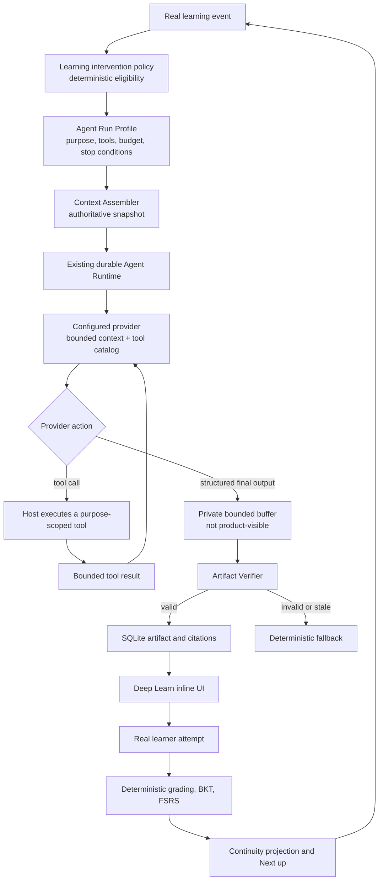

# Keen Agent-native architecture and delivery plan

Status: **verified through Slice 3; Slices 4 and 5 are in progress**.

Date: 2026-07-23.

This document defines the next capability phase after the current Alpha learning loop. It is subordinate to `docs/PRODUCT_POSITIONING.md` and does not replace the verified Tauri, React/Vite, FastAPI, SQLite, retrieval, Conversation, Study Session, BKT, FSRS, Feed, History, Review, or sidecar contracts.

The decision is to evolve Keen incrementally into a bounded learning Agent. Keen will not import another full Agent runtime, add an Agent product area, or begin Hermes-style automatic skill activation before the core learning Agent loop has real outcome evidence.

The learner-problem evidence and its limitations are recorded in `docs/AGENT_NATIVE_USER_RESEARCH.md`. That brief is directional public research, not a representative survey or a claim that the planned intervention improves learning.

## Product decision

Keen's target is:

> A source-grounded desktop learning Agent that maintains a learner's current goal, chooses a bounded teaching action when evidence requires it, uses scoped tools, validates the artifact contract and source handles, waits for a real learner attempt, persists the outcome, and restores the next action after interruption or restart.

Agent-native does not mean generic chat, unlimited autonomy, a large tool count, multi-Agent spectacle, or self-modifying prompts. It means Keen owns this closed loop:

```text
observe authoritative learning state
→ choose one bounded action
→ use an exact tool profile
→ validate a structured artifact contract and source handles
→ wait for a real learner action
→ update deterministic learning state
→ persist and restore the next action
```

Hermes-style procedural learning is a later self-improvement layer. The first requirement is to make the existing Agent Runtime participate in one real Study intervention.

This phase does not change Keen's product category or widen its initial audience. Keen remains for self-directed learners using a bounded source set to pursue one concrete learning goal across explanation, Recall/Practice, Review, and return. Agent-native behavior is an execution-quality improvement inside that workflow, not a general Agent mode or Personal Learning OS expansion.

## Current baseline

The current repository already provides most infrastructure required for this phase:

- a supervised Tauri desktop and authenticated FastAPI sidecar;
- versioned SQLite domain and Agent run/event/tool/approval state;
- durable Conversation, real configured DeepSeek text/citation evidence, and restart recovery;
- source-scoped Focused Study creation;
- multi-unit Study Sessions with Diagnostic, Recall, bounded remediation, Practice, Summary, and Review handoff;
- deterministic grading, BKT evidence, and FSRS scheduling;
- Feed, History, Home `Next up`, cancellation, idempotency, reconcile, and restart behavior;
- an existing provider loop, tool registry, immutable provider tool catalog, event replay, approval, and Undo foundation.

The main gap is not another runtime. The production Study flow does not yet invoke the durable Agent Runtime for a learning intervention, and the current provider tool catalog is selected mainly by course scope rather than by a narrow learning purpose.

## Research-derived experience constraints

The research narrows the architecture rather than adding features:

1. **Attempt before evidence-bearing help.** A generated explanation may follow a real Recall attempt, but it cannot replace that attempt or count as learning evidence. Do not impose a universal timed reading gate; the invariant is that assistance cannot silently perform the assessed work.
2. **One selective intervention, not output amplification.** Importing a source never triggers a whole-course deck, quiz, summary, or review set. The first Agent artifact addresses one current Unit and one recorded attempt.
3. **Visible scope, not assumed trust.** The learner can identify the current Unit, source scope, durable citations, and ingestion limits. An intervention never expands to the web, another course, or a stale source revision without a separate authorized product action.
4. **Mixed initiative, not a prompt box.** The host policy selects one specific eligible teaching move and states `why now`, `using which sources`, and `what happens next`. The learner activates, steers, skips, or cancels the move without restating the current context or authoring a general prompt.
5. **Control at the strategy boundary.** Low-risk reads use the already selected scope without per-tool approval. Plan changes show one bounded diff and require an explicit decision. State writes retain receipts, CAS, and safe Undo; external or destructive actions remain outside this phase.
6. **Structured continuity, not transcript Memory.** Goal, Session, Unit, attempt, evaluation, citations, explicit steering, and next action persist. Raw chat history, inferred personality, motivation, fatigue, anxiety, and fixed learning-style labels do not become learner state.
7. **Quiet proactivity.** The intervention appears inline at a real checkpoint. No modal, pop-up warning, Agent avatar, activity dashboard, third Study column, or permanent action-chip row is added.
8. **Independent outcome evidence.** Subsequent unassisted Practice and delayed Review matter. Generation success, explanation length, token/tool counts, dwell time, and model self-rating do not.

## Agent-native v1 exit contract

Keen may describe the v1 learning flow as Agent-native only when all of the following are verified:

1. The learner supplies a goal once and the exact goal/source/session scope survives the complete flow.
2. Keen can assemble the current Unit, real attempt, authoritative evaluation, source scope, and allowed next actions without model inference.
3. A deterministic policy decides whether an Agent intervention is eligible.
4. The Agent receives a purpose-specific run profile with an exact tool allowlist and fixed budget.
5. The generated artifact is schema-, citation-, scope-, and revision-checked before display.
6. The learner can steer, cancel, retry, or return to the deterministic path.
7. The model cannot write grading, mastery, BKT, FSRS, Task completion, Session completion, or confirmed misconception state.
8. The next real attempt remains the learning evidence; generated explanation is not treated as evidence of mastery.
9. The run, artifact, citations, and current learning state survive reload and process restart.
10. Provider absence or failure falls back to a truthful deterministic action rather than simulated Agent success.
11. The inline intervention communicates `why now`, the exact allowed source scope and its ingestion limits, and the next learner action without exposing prompts, chain of thought, or an Agent console.
12. Each citation can resolve to the durable source snapshot and exact excerpt/page context supported by the existing citation capability; unsupported geometry or partial extraction fails visibly.
13. The slice creates no bulk notes, cards, quizzes, Review items, or hidden future workload.

Automatic Playbook extraction is not part of this exit contract.

## Target architecture



### State ownership

| State | Authoritative owner | Agent authority |
| --- | --- | --- |
| Goal, Session, current Unit | Study Session domain | Read; later propose a bounded plan diff |
| Recall/Practice result | Deterministic evaluator | Read only |
| Mastery evidence and BKT | Deterministic learning engine | Read only |
| FSRS rating, stability, due date | Review flow | Explain a recorded reason; never write |
| Source and citation membership | Retrieval and SQLite | Select only opaque handles returned by this run; never create or rewrite citation objects |
| Explanation, hint, worked-example text | Contract-validated, source-linked Agent artifact | Model generates bounded content; trusted verifier/repository persists only after validation |
| Study Plan | Versioned plan domain | Propose; never mutate directly |
| Task or Session completion | Owning Study/Review flow | No authority |
| Cross-page Next up | Existing Learning Snapshot and Home continuity projection | No free-form model selection and no second coordinator |

The authoritative protection is structural: generated prose is never a domain mutation. The verifier can reject known unsupported state claims, but schema validity, source-handle membership, and citation resolution are not a claim of complete factual-entailment verification. Product copy and evidence records must call the artifact `contract-validated` or `source-linked`, never fact-checked or verified prose.

## Learning Agent modules

The implementation should add a narrow bounded context under the existing Python application:

```text
services/learning-core/app/learning_agent/
├── types.py
├── context.py
├── policy.py
├── profiles.py
├── playbooks.py
└── verifier.py
```

Responsibilities:

- `types.py`: closed trigger, context, profile, artifact, and verifier result types.
- `context.py`: read and validate the authoritative learning snapshot.
- `policy.py`: deterministic eligibility and Playbook selection.
- `profiles.py`: trusted run profiles, tool allowlists, budgets, and fallbacks.
- `playbooks.py`: immutable, versioned built-in teaching procedure definitions.
- `verifier.py`: artifact schema, citation membership, course/session/unit scope, current revision, and profile checks.

Service and persistence boundaries:

```text
services/learning-core/app/services/learning_intervention.py
services/learning-core/app/services/study_plan_proposal.py
services/learning-core/app/repositories/learning_agent_artifact_repository.py
services/learning-core/app/routers/learning_interventions.py
services/learning-core/app/routers/study_plan_proposals.py
services/learning-core/app/agent/tools/learning.py
```

Existing `AgentRuntimeManager`, `AgentOrchestrator`, event store, tool executor, provider adapters, approval service, SQLite audit sink, and SSE replay remain authoritative. Do not create a second run ledger, checkpointer, Session Store, or provider runtime.

## Purpose-specific Agent Run Profile

The current runtime must gain a host-selected profile so a learning intervention cannot inherit every course-scoped product tool.

```ts
type AgentRunProfile = {
  id: string;
  playbookSlug: string;
  playbookVersion: number;
  definitionHash: string;
  allowedTools: string[];
  permissionCeiling: 1 | 2;
  requiredContextSlots: string[];
  outputArtifactKind: string;
  limits: {
    maximumModelTurns: number;
    maximumToolCalls: number;
    maximumCorrectionRetries: number;
    maximumOutputBytes: number;
  };
  stopConditions: string[];
  fallback: string;
};
```

The first profile is fixed in code:

```text
id: learning.intervention.source-grounded.v1
playbook: source-grounded-remediation@1
allowed tools:
  - search_course_knowledge
permission ceiling: Level 1
maximum model turns: 4
maximum tool calls: 2
maximum correction retries: 1
fallback: deterministic_source_review
```

These counts are conservative product limits, not learning-science constants. The existing generic runtime ceiling remains a hard upper bound; the profile can only reduce it.

The authoritative Context Assembler snapshot is frozen into the run input; the first profile does not expose a second `get_current_learning_context` tool. `search_course_knowledge` is the only model-callable tool, but the host—not the model—injects the course and source scope. The model may supply only a bounded query and result limit. Retrieval is forcibly intersected with the frozen `allowedChunkIds`; the model cannot widen it to another document, Unit, Session, or same-course chunk. The verifier still rechecks the live Session revision and source versions before commit, so a context change cannot be hidden by the frozen input.

The profile is selected by the domain service, not supplied by the client or model. The exact profile and Playbook identity must be persisted with the run input and artifact. The intervention profile must not expose `complete_study_task`, arbitrary SQL, filesystem, Shell, external web, calendar, or cloud tools.

## Learning trigger and context contracts

```ts
type LearningTrigger = {
  courseId: string;
  sessionId: string;
  unitId: string;
  triggerAttemptId: string;
  expectedSessionRevision: number;
  triggerType:
    | "recall_incorrect"
    | "practice_incorrect"
    | "user_requested_explanation";
};
```

The Context Assembler produces a bounded snapshot:

```ts
type LearningAgentContext = {
  goal: string;
  sessionStatus: string;
  sessionRevision: number;
  currentUnit: {
    id: string;
    title: string;
    objective: string;
  };
  triggerAttempt: {
    id: string;
    prompt: string;
    learnerResponse: string;
    authoritativeGrade: "correct" | "incorrect";
    hintCount: number;
  };
  sourceScope: {
    courseId: string;
    allowedChunkIds: string[];
  };
  priorInterventions: Array<{
    artifactId: string;
    playbookSlug: string;
    status: string;
  }>;
  allowedNextActions: Array<
    "review_source" | "continue_practice" | "pause"
  >;
};
```

For v1, `goal` is projected from the current persisted learning request or Study Session scope. This plan does not introduce a cross-Session Goal aggregate. If the current records do not contain one valid bounded goal, the intervention is ineligible.

The assembler fails closed when:

- course, Session, Unit, attempt, or source scope do not match;
- the trigger is not the latest applicable learning event;
- the Session revision changed or the current Unit advanced;
- the Session is completed, cancelled, or failed;
- required current-version source chunks are unavailable;
- the answer was revealed before the attempt, making it ineligible as independent recall evidence;
- the bounded remediation policy is already exhausted.

No new generic evidence ledger is required for v1. The assembler projects the existing attempt, evaluation, mastery-evidence, Review, Session, and event records into this DTO rather than duplicating learning truth.

## First product slice: source-grounded intervention

### User flow

```text
incorrect Recall is persisted by deterministic code
→ deterministic policy selects “Generate an explanation from these excerpts”
→ Deep Learn shows why it is eligible, the intended current source preview, and the following Practice action
→ learner activates the bounded intervention or continues to source review / Practice
→ intervention preflight revalidates current source and Session revisions, then freezes the actual run scope
→ one Agent run reads the current context and frozen Session/Unit source scope
→ provider returns structured explanation plus selected run-scoped source handles
→ verifier resolves those handles and attaches canonical citations
→ artifact commits before the ready event
→ Deep Learn displays it inline
→ learner continues to the existing deterministic Practice
```

The Agent artifact contract is intentionally small:

```ts
type LearningInterventionArtifact = {
  schemaVersion: 1;
  summary: string;
  explanationMarkdown: string;
  selectedSourceHandles: [string, ...string[]]; // verifier-enforced length: 1–8
};
```

The provider does not choose the next workflow transition. After verification, the trusted domain service attaches the current authoritative action from the frozen `allowedNextActions` and rechecks it against live Session state. Deep Learn never changes flow from a model-authored next-action hint.

The verifier must check:

- strict Pydantic schema and byte limits;
- the exact run profile and Playbook version;
- the artifact selects 1–8 handles; zero handles is `source_not_found` or `invalid_output` and falls back to deterministic source review;
- every selected handle was issued by this run and belongs to the intersection of the run-issued result set, frozen `allowedChunkIds`, and current source versions; the verifier resolves it and creates the canonical citation rows;
- the trigger attempt, Session, Unit, and revision are still current;
- tool, round, retry, and permission budgets were respected;
- no structured mastery, BKT, FSRS, plan-write, Task-completion, or Session-completion claim exists;
- the artifact is committed only after all checks pass.

Failure produces a specific deterministic outcome such as `source_not_found`, `provider_missing`, `provider_failed`, `invalid_output`, `stale_learning_state`, `cancelled`, or `interrupted`. The existing source-review path remains usable.

The initial rollout remains learner-activated after the policy-selected offer. It should require one action, not a prompt. Automatically starting provider work is a later product decision that requires evidence that it improves flow without unwanted interruption or hidden provider use; being Agent-native is not sufficient authorization by itself.

### Provider capability gate

The existing real DeepSeek acceptance verified text and citations through the Conversation path; it did not verify a tool-capable Agent run. Before claiming the intervention complete:

1. send one isolated read-only tool-call request through the configured provider adapter;
2. verify the tool request, host result feedback, final structured output, cancellation, and event replay;
3. record the actual supported model/version;
4. if tool calling is unsupported or unreliable, use host-assembled context plus structured provider output under the same Artifact contract and describe it as a bounded generated intervention, not a verified tool-using Agent.

Keen must not wait indefinitely for one provider capability: the deterministic source-review fallback keeps the Study flow usable.

## Data plan

### Dedicated learning Agent artifact tables — deferred

The current bounded intervention and plan-proposal artifacts are immutable
validated checkpoints in the existing durable Agent event store. Their source
handles resolve to host-frozen citation snapshots before publication. No
separate artifact/citation tables were added because the current restore,
supersession and source-lineage requirements are already met without a second
artifact authority.

Candidate tables, only if later lineage queries demonstrate a real need:

```text
learning_agent_artifacts
- id
- run_id
- course_id
- study_session_id
- study_unit_id
- trigger_attempt_id
- trigger_session_revision
- kind
- status: active | superseded | invalidated
- playbook_slug
- playbook_version
- playbook_definition_hash
- content_json
- supersedes_artifact_id nullable
- created_at
- invalidated_at nullable

learning_agent_artifact_citations
- id
- artifact_id
- source_index
- document_id
- chunk_id nullable after source cleanup
- document_version_id
- chunk_content_hash
- document_name_snapshot
- page_number nullable
- quote
- section_path_json
- geometry_json nullable
- metadata_json
```

An interrupted or failed run creates no artifact row; that outcome remains on the durable run/operation record. The citation contract must reuse or equal the durable snapshot semantics already proven by migration `027`: a new row requires an exact current document/version/chunk/hash/scope match, while a later reindex or permitted source cleanup may detach the live `chunk_id` without erasing the saved document name, quote, section path, page/geometry, version, or content hash used by History and restart recovery. Document deletion remains an explicit protected operation rather than a cascading loss of learning evidence.

Any later migration must add cross-scope and lineage checks proportionate to existing Study/Agent triggers. Source identity is attached by trusted host verification from a run-scoped source handle, not accepted as a model-created citation object. Artifact and citation snapshots are append-only; a new artifact supersedes an earlier one rather than rewriting history.

### Migration 031 — bounded Study Plan proposals

Implemented table:

```text
study_plan_proposals
- id
- run_id
- validated_artifact_id
- course_id
- study_session_id
- base_plan_version
- base_plan_id
- base_session_revision
- trigger_event_ids_json
- proposal_json
- reason_json
- status: pending | accepted | rejected | invalidated | undone
- accepted_plan_version nullable
- undo_plan_version nullable
- undo_until nullable
- decision_idempotency_key
- undo_idempotency_key nullable
- created_at
- resolved_at nullable
- undone_at nullable
```

`validated_artifact_id` points to a contract-validated, source-linked
plan-proposal checkpoint whose citations use the same trusted handle resolution
and durable snapshot contract as the intervention artifact. A decision row
cannot commit before that artifact is current and its source scope is
revalidated.

Acceptance is a Level 2 local mutation. It uses compare-and-swap validation,
creates a new `study_plan_versions` row, does not mutate historical plans, and
preserves the currently active Unit until its normal completion boundary.
Success returns an operation receipt with a bounded Undo window. Undo succeeds
only while the learner remains on that preserved current Unit and no learning
evidence depends on the accepted version; it appends a new plan version
restoring the prior unstarted sequence. If later learning evidence makes
reversal unsafe, Undo fails closed and explains that the current plan was
retained.

### Future migration — trigger ledger, conditional

Do not create this migration unless real duplicate event delivery cannot be prevented with existing run idempotency. If required, it records only source event identity, policy version, decision, linked run/artifact/proposal, supersession, and timestamp.

### Future migration — Playbook candidates, conditional

Do not create Playbook definition, evaluation, deployment, or candidate tables until the v1 Artifact path has accumulated real, attributable outcome lineage.

## Domain API plan

The first domain routes are:

```text
POST /v1/study-sessions/{session_id}/interventions
GET  /v1/study-sessions/{session_id}/interventions/current
POST /v1/study-sessions/{session_id}/interventions/{run_id}/cancel
```

Example create request:

```json
{
  "courseId": "course-…",
  "unitId": "unit-…",
  "triggerAttemptId": "attempt-…",
  "expectedSessionRevision": 8,
  "intent": "alternative_explanation",
  "clientRequestId": "…",
  "idempotencyKey": "…"
}
```

Example accepted response:

```json
{
  "runId": "run-…",
  "status": "queued",
  "eventsUrl": "/v1/study-sessions/session-…/interventions/run-…/events"
}
```

The API reuses the existing durable Agent event store and replay cursor, but it must not expose the generic run stream directly to the product UI. It requires authentication, strict Pydantic input, the established request-body bound, idempotency, current revision, and course/session ownership. The generic Agent create endpoint is not a product UI entry.

### Intervention finalization seam

The current generic Agent loop persists `content_delta` as it arrives and marks a run completed when the provider finishes. That behavior is not a safe completion contract for a learning intervention. The intervention profile requires a product-specific finalization seam:

1. provider text or structured final output is accumulated in a private bounded buffer or internal-only event audience;
2. raw provider deltas, tool arguments, and unverified final output are never returned by the intervention event route;
3. the product-visible stream contains only durable, truthful stage events backed by real transitions, such as `started`, `tool_started`, `tool_finished`, `validating_contract`, `artifact_ready`, `cancelled`, `interrupted`, and a bounded safe failure code;
4. the verifier validates schema, scope, revision, source handles, profile budgets, and prohibited state claims;
5. one trusted transaction persists the contract-validated artifact and canonical citation snapshots, finalizes the intervention outcome, and appends `artifact_ready` before any ready content is visible;
6. a crash before that transaction restores as interrupted with no visible artifact; a crash after commit replays the same `artifact_ready` and artifact identity without calling the provider again;
7. validation failure stores only bounded diagnostic metadata and exposes a safe fallback state, never the rejected provider body.

This may be implemented as a narrow publication policy on the existing runtime or as an intervention repository bridge. It must not create a second run engine, checkpoint store, or competing source of Agent truth.

## Desktop plan

Planned feature files:

```text
apps/desktop/src/features/deep-learn/LearningIntervention.tsx
apps/desktop/src/features/deep-learn/useLearningIntervention.ts
apps/desktop/src/features/deep-learn/PlanProposalDiff.tsx       # later slice
```

The API-client contracts remain under the existing `packages/api-client` boundary and use strict Zod validation.

The intervention appears only in the existing Deep Learn reading column. It reuses the current path rail, reading width, citation disclosure, button, status, focus, and recovery patterns. It must not add:

- chat bubbles, an assistant avatar, or a floating composer;
- a third persistent Study column;
- Agent Activity or Teaching Playbook primary navigation;
- raw chain of thought, prompt text, tool arguments, or model self-reflection;
- a decorative simulation of tool stages.

Durable stages such as `reading_context`, `searching_sources`, `validating_contract`, and `ready` require matching backend events. The UI maps `validating_contract` to `Checking source links and scope`, not `Verifying the answer`, because this does not fact-check the prose. The full state set includes eligible, starting, running, validating-contract, ready, cancelled, interrupted, provider missing, failed, and stale.

The eligible state is a flat inline continuation of the recorded Recall result, not a new card stack. In compact language it shows:

- `Why now`: the persisted Recall did not meet the expected answer;
- `Scope`: before activation, the intended current document names and eligible excerpt/page ranges for the current Unit, with partial extraction or unavailable diagrams visible;
- `Then`: continue to a new Practice attempt.

The eligible preview is not the frozen run scope. Activation revalidates the current Session and source revisions, freezes the actual allowed chunks/documents, and either updates the visible scope to that snapshot or fails closed as stale; it never silently carries a changed preview into the run.

The first ready state has one primary action: `Continue practice`. It shows the actual frozen scope. `View sources` is a disclosure control that opens the durable source snapshot using the existing citation/PDF pattern where supported; partial extraction, unavailable geometry, and unsupported diagrams remain visible rather than being presented as exact coverage. Closed explanation steering (`Explain another way`, `Use an example from these excerpts`, `Make it shorter`) sits behind one quiet secondary `Try another approach…` menu; `Test me instead` is a secondary direct handoff to the existing Practice flow. `Cancel` appears only while a real run is active, and `Return to source` remains a low-emphasis escape. These controls must not become an equal-weight action-chip toolbar or an unbounded conversation.

## Steering and recovery slice

Steering is the second user-visible Agent slice:

- `different_explanation`
- `source_example`
- `shorter`
- `direct_test`
- `cancel`

One Study Session may have at most one active intervention run. A new steering intent either cancels and supersedes the active run or fails closed while cancellation is uncertain. Each successful steering run creates a new immutable artifact linked to its predecessor. Entering a new Unit invalidates control by the old artifact.

The existing cancel, interrupted recovery, Last-Event-ID replay, idempotency, and reconcile infrastructure should be reused. Do not create a parallel Conversation transcript.

## Bounded Plan Proposal slice

Slice 3A began as a deliberately read-only vertical contract. An
explicit learner request can currently propose only one source-grounded
prerequisite before a trusted unstarted Unit. The host freezes the exact
Session revision, current plan ID/version, Unit sequence, target and durable
source snapshots. The purpose-specific Run Profile permits only bounded
source search, validates the provider JSON and issued source handles, and
publishes an immutable checkpoint artifact. The authenticated create/current endpoints and strict
TypeScript client restore `none / queued / running / ready / stale /
unavailable` truth.

Slice 3B renders that contract inline in the existing Deep Learn document
after a ready Agent explanation and before the independently scored Practice.
It restores the current durable run, polls only queued/running work, keeps an
exact frozen retry for uncertain writes, refreshes conflicts instead of
replaying them, and shows the current/proposed sequence plus citations as a
flat document diff. Before a decision, the artifact remains visibly `not
applied`; Practice stays independently scored. A real `deepseek-v4-flash` run and full app/sidecar
restart restored the same artifact without changing the Session revision,
current plan version or Unit count.

Slice 3C adds the deterministic decision boundary. `Accept adjustment`
revalidates the frozen Session revision, plan version, target and durable source
handles inside one transaction, then appends a new plan version that becomes
active only after the current step. `Keep current plan` persists the decision
without creating a plan version. A receipt exposes the effective boundary and
bounded Undo window. Undo appends a restore version only before the learner
advances or any learning evidence depends on the accepted plan. The model
retains no plan-write authority.

A plan proposal may be offered only when a deterministic policy observes one of these conditions:

- the same misconception pattern appears in independent attempts;
- remediation followed by parallel practice still fails;
- current evidence shows a prerequisite gap;
- the learner explicitly changes the goal or time budget.

One incorrect answer never rewrites the plan.

Allowed proposal operations are initially limited to:

- insert one source-grounded prerequisite Unit before an unstarted Unit;
- split one unstarted Unit;
- reorder unstarted Units;
- add one bounded practice step.

The Deep Learn UI shows the current and proposed sequence, reason codes, and citations from the contract-validated, source-linked proposal artifact. `Accept adjustment` is the single primary decision; `Keep current plan` is the safe secondary action. The Agent never executes the plan mutation; the deterministic service validates the base revision and writes a new plan version after acceptance. A successful acceptance shows the real receipt and transient safe Undo defined above.

## Session Steward slice

The Session Steward makes the product feel continuous without becoming an unattended general Agent.

The deterministic next-action priority remains:

```text
1. due Review
2. started but incomplete Study Session
3. explicit source-scoped learning request
4. executable Feed Task
5. no saved action → New learning
```

The existing `LearningSnapshotService` and Home continuity projection already own most of this behavior. This slice first reuses and aligns those contracts on application readiness, Home focus, real Study/Review completion, pause/resume, and explicit refresh. Extract a shared service only if tests demonstrate an actual cross-page inconsistency; do not create a second next-action authority or state store. Evaluation is event-driven, not an infinite background loop. The Agent is invoked only for a learning explanation or plan proposal. `Next up` remains a projection of authoritative SQLite state and remains usable when no provider is configured.

Do not add a `LearningJourney` table during this phase. Add a durable Goal/Journey aggregate only if a verified requirement needs one goal across multiple Sessions, multiple concurrent goals inside one course, goal-scoped Feed/Review, or cross-Session objective evolution.

## Teaching Playbooks

Hermes separates factual Memory from procedural Skills and loads detailed skills on demand. It can also create and update skills through an Agent tool. Keen adopts the procedural-memory and progressive-disclosure concepts, not the unrestricted self-modification model:

- <https://github.com/NousResearch/hermes-agent/blob/main/website/docs/guides/work-with-skills.md>
- <https://github.com/NousResearch/hermes-agent/blob/main/agent/prompt_builder.py>
- <https://github.com/NousResearch/hermes-agent/releases>

Keen uses `TeachingPlaybook`, not `Skill`, to avoid confusion with learner knowledge skills and course concepts.

### Playbook definition

A Playbook is a closed declarative contract, not arbitrary Markdown, code, or a plugin:

```json
{
  "slug": "source-grounded-remediation",
  "version": 1,
  "purpose": "remediation",
  "trigger": "active_recall_incorrect",
  "requiresIndependentAttempt": true,
  "contextSlots": [
    "goal",
    "currentUnit",
    "triggerAttempt",
    "authoritativeEvaluation",
    "sourceChunks"
  ],
  "allowedTools": [
    "search_course_knowledge"
  ],
  "permissionCeiling": 1,
  "maximumModelTurns": 4,
  "maximumToolCalls": 2,
  "maximumCorrectionRetries": 1,
  "artifactKind": "alternative_explanation",
  "fallback": "deterministic_source_review"
}
```

The DSL permits only registered triggers, context slots, tools, artifact kinds, stop conditions, and bounded parameters. It forbids dynamic code, Shell, SQL, arbitrary paths or URLs, new tool definitions, permission elevation, system-prompt edits, course-text copies, and changes to grading/BKT/FSRS/citation rules.

### Built-in v1 Playbooks

Start with four code-owned, immutable, versioned Playbooks:

1. `source_grounded_remediation`
2. `progressive_hint`
3. `worked_example_fading`
4. `self_explanation`

The deterministic policy selects the Playbook. The model generates content within the selected procedure but cannot choose the learning state transition. `parallel_practice` remains owned and graded by the existing deterministic Study state machine.

Every execution records the exact Playbook slug, version, definition hash, trigger, run, artifact, Session/Unit, and subsequent real attempt/Review lineage. An explanation being generated or liked is not evidence that it improved learning.

## Hermes-style candidate extraction

Automatic Playbook extraction is a v1.5 experiment and must not begin before real v1 executions have attributable learner outcomes.

### Definition lifecycle

```text
draft
→ static_validated
→ offline_evaluated
→ eligible
→ retired

failure or invalidation:
rejected | invalidated
```

### Deployment lifecycle

```text
not_deployed
→ shadow
→ canary
→ active
→ paused | rolled_back | retired
```

A Candidate can only produce a bounded diff against an existing Playbook. Allowed diff operations are reordering existing steps, changing an allowed parameter within host limits, adding an existing step, or removing an optional step. A Candidate cannot add a tool, raise permissions or budgets beyond host limits, change output schemas, create code, modify system constraints, or declare itself successful.

### Initial candidate threshold

An initial conservative operational threshold may require:

- at least five complete executions;
- at least three Sessions;
- at least two independent items or concepts;
- a repeated signal such as requests for another explanation, independent practice failure after remediation, repeated maximum hint use, or repeated abandonment.

These values are configurable product thresholds, not scientific constants. Provider-missing, no-source, invalid-citation, cancelled, interrupted, stale-revision, answer-revealed, and same-item direct-repeat trajectories are ineligible for learning-effect claims.

### Candidate generation

The generator receives structured, content-minimized trajectory summaries rather than full transcripts or course text. It may propose only a DSL diff. Generation initially occurs through an explicit internal action; a later background option requires user opt-in because it can incur provider requests.

The generated record remains `draft`. The model cannot promote it.

### Evaluation

Evaluation proceeds in increasing-impact stages:

1. **Static validation:** schema, allowed enums, tools, permissions, budgets, stop conditions, forbidden content, and definition hash.
2. **Read-only snapshot replay:** fixed historical contexts, read-only tools, no real learning-state writes.
3. **Provider-assisted quality review:** optional clarity, duplication, and answer-leakage signal; never sufficient to prove learning efficacy.
4. **Shadow:** optional and off by default; result is not shown and does not affect Study.
5. **Canary:** a user-approved small deployment with immediate built-in fallback.
6. **Outcome observation:** later independent practice, hint dependence, delayed Review, cancellation, and return-to-previous-approach behavior.

Single-user local evidence must be described as limited personal evidence, not statistically significant improvement.

### Activation and rollback

For v1.5, only the user or developer can approve Canary deployment. Activation is a local reversible configuration mutation that retains the previous deployment. New runs use the new version; active runs keep their frozen version.

A Candidate version is immediately quarantined when it attempts an unauthorized tool, exceeds the profile, fails the artifact schema, cites outside the current retrieval set, uses a stale Session revision, attempts to mutate grading/BKT/FSRS, or cannot satisfy its stop conditions. The built-in Playbook remains the fallback.

Settings may later expose a non-primary experimental `Teaching approaches` area with Candidate diff, evidence limits, validation status, Canary approval, rollback, and a global `Disable candidate teaching approaches` switch. It is not a primary navigation item or a free-form Skill editor.

## Memory model

Keep three layers separate:

1. **Domain memory:** courses, sources, goals, Sessions, attempts, evaluations, mastery evidence, Review, tasks, citations. Existing SQLite records are authoritative.
2. **Learner preference memory:** Slice 2 steering applies only to the selected intervention and is not silently remembered. A later cross-Session preference such as shorter explanations or examples first requires an explicit save action, recorded provenance and scope, an inspect/edit/reset control in Settings, and a clear `this intervention / this Session / future Sessions` boundary. Do not infer personality, motivation, anxiety, fatigue, or fixed learning style from behavior.
3. **Procedural memory:** immutable Teaching Playbooks and later validated Candidate versions.

Do not add a context-compaction module in Slices 0–1: the first profile is already bounded to four model turns and two tool calls. If measured provider limits later prove that compaction is necessary, schedule it as a separate slice; it may summarize only model/tool history and may never replace source provenance, a real attempt, a deterministic grade, BKT evidence, FSRS state, goal scope, or the current Session revision.

## Phased delivery roadmap

### Slice 0 — Agent integration contract

Status: `verified` as the trusted profile, bounded context, fail-closed policy,
purpose-scoped tool and no-learning-write foundation used by Slice 1.

Deliver:

- trusted Run Profile contract;
- Context Assembler DTO and fail-closed rules;
- deterministic eligibility/selection policy;
- one built-in `source_grounded_remediation@1` definition;
- provider tool-call capability probe;
- regression proving no learning-state mutation.

Exit:

- one wrong-attempt fixture produces a bounded context or an explicit `NoIntervention` reason;
- cross-course, stale, terminal, missing-source, and revealed-answer cases fail closed;
- no UI, migration, or learning behavior is claimed yet.

### Slice 1 — Source-grounded intervention

Status: `verified`. One incorrect Recall can enter the bounded, source-linked
intervention profile, publish only a contract-valid artifact, fall back
truthfully, and continue to the independently graded canonical Practice.

Deliver:

- migration 031;
- Artifact repository, service, router, strict API client;
- purpose-scoped learning tools and verifier;
- Deep Learn inline intervention with real states and citation disclosure;
- provider-missing fallback, cancel, idempotency, and reload recovery.

Exit:

- one real incorrect attempt → one contract-validated, source-linked explanation → supported source context opens and partial/unsupported limits remain visible → existing Practice continues → reload restores both Artifact and learning state;
- one packaged Tauri run verifies the configured real provider path or truthfully records that the provider lacks tool support;
- no Task, mastery, BKT, FSRS, or plan mutation is produced by the Agent.

### Slice 2 — Steering and recovery

Status: `verified`. The selected-artifact lineage increment is implemented
and verified in focused backend, API-client and Deep Learn component coverage.
A new alternative must name the latest ready run and artifact, missing or stale
identity fails closed, exact retries replay the frozen request, and the new
artifact records its immutable predecessor. Direct Practice uses the same
current-head check and reuses the existing Practice; grading, mastery, review
scheduling, Task, Session and misconception truth are unchanged. A rebuilt
ad-hoc `Keen Dev.app` used the configured `deepseek-v4-flash` provider to create
and render one source-example successor, then restored the same successor and
single Practice through a full app/sidecar restart. The run input and artifact
checkpoint carry the exact same predecessor pair.

Deliver closed steering intents, one-active-run ownership, superseding artifacts, current-Unit invalidation, cancel/reconcile, keyboard focus, and reduced-motion behavior.

Exit: steering never creates an unbounded Conversation, cannot apply to a stale Unit, and affects only the chosen intervention; it does not silently create a cross-Session learner preference.

### Slice 3 — Bounded Plan Proposal

Status: `verified` at the bounded proposal and deterministic decision/Undo
boundaries. The Slice 3A contract supports one
`insert_prerequisite` operation before an unstarted Unit, freezes and
revalidates the base Session/plan/source scope, publishes durable citation
snapshots, fails closed on stale or invalid scope, and never mutates learning
state before acceptance. The inline UI covers restore, exact uncertain retry,
conflict refresh, provider recovery, stale truth, the source-linked sequence
diff, explicit Accept/Keep, receipt and bounded Undo. The original read-only
evidence is 4 desktop files / 61 tests plus strict TypeScript, scoped ESLint,
production build, Debug `.app` build and strict deep signature verification. Real run
`run-bc977440c88544de8af7063797f55ac7` produced artifact
`plan-proposal-artifact-7c0ad5c67df28f319ccde52c39be56bf`; full app/sidecar
restart restored it while the Session remained revision 7 on plan version 1
with two Units. Slice 3C focused verification passed Python plan/migration
24/24, desktop component 9/9 and API-client contract 5/5, plus strict
TypeScript and ESLint. Decision/Undo validation used isolated deterministic
fixtures and did not mutate the user's saved learning data.

Next deliver Slice 4 Session Steward by reconciling one authoritative next
action from existing persisted Session, Task, Review, Feed and History state.

Exit: only repeated or explicit evidence can trigger a proposal; no plan changes before acceptance; accepted changes are provenance-complete and reversibly restored only while no later learning evidence would be lost.

### Slice 4 — Session Steward

Status: `verified` at the continuity, cache-reconciliation and packaged
service/durable-state restart boundaries. The bounded continuity repair and cross-page cache
reconciliation are verified: when
there is no due Review or persisted Task, Home now consumes the existing
course-scoped `resume_study_session` candidate and resolves it against the exact
current Session history. Terminal, missing and cross-course matches fail
closed. A valid match exposes the saved goal, progress and phase-specific
resume action and opens the exact Deep Learn route. It creates no Task,
recommendation, Journey record or provider run. Focused Home continuity/App
coverage passed 3 files / 30 tests.

Confirmed Deep Learn state changes now invalidate the existing exact Session,
adaptive state, Session History, Learning Snapshot and due Review queries.
Home, Learning Feed and History withhold cached actions while those reads
revalidate. A fresh QueryClient restart restores the current Session through
the existing service contracts rather than a prior in-memory value. Focused
cross-page coverage passed 5 files / 76 tests, Review/Summary regression passed
2 files / 30 tests, and strict TypeScript, ESLint and `git diff --check` passed.
No coordinator or second state store was required.

Deliver convergence on the existing Learning Snapshot and Home continuity contracts, event-driven reevaluation, duplicate-trigger prevention using existing idempotency first, and truthful operation receipts/recovery. Add a shared coordinator only if a failing cross-page contract test proves it is necessary.

The current ad-hoc arm64 package rebuilt with migrations `001–032`; mounted-DMG
verification, strict standalone signature, bundled-sidecar smoke and isolated
Review/FSRS process restart/replay passed. In a separate isolated temporary
profile, the packaged sidecar created a real focused-study Task, non-empty
Session, two-Unit plan and pending Diagnostic through the public APIs. A full
process stop/restart restored the exact Session, plan and checkpoint at
revision 2 in `diagnosing`/`pending` state; History found the same Session and
an exact creation retry returned `replayed`. Pre/post table counts were
identical and no provider, Agent-event or outcome-lineage row appeared.

ChatGPT Pro accepted this as closing Slice 4's packaged
service/durable-state restart gate. A native WebView observation of that
restored state remains a separate non-blocking visual check; no packaged UI
hydration, Developer ID, notarization or parity claim is made here. Evidence is
under `artifacts/orchestrator/slice-04-restart/`. The product remains usable
without a provider.

### Slice 5 — Built-in Playbook expansion and outcome lineage

Status: `in progress`. Migration `032` and the internal outcome repository now
record immutable exposure lineage from each durably published intervention
artifact to the canonical Practice that follows it and, when created, that
Practice's exact Review item lifecycle. A link means that the learner was
exposed to an artifact before the later independent work; it does not claim
that the artifact caused the Practice or Review result.

Visibility is gated by the durable published checkpoint. A crash between the
lineage write and artifact publication can leave an internal row, but session
queries hide it until the matching artifact ID and kind are durably published.
Multiple steered artifacts may point to the same Practice. Review lookup is
fixed to `practice_run_id → handoff.review_item_id → attempts for that exact
review_item_id`; it never selects a session-, course-, or concept-wide latest
attempt. The internal projection includes the attempt's schedule revision
before and after, but does not expose raw learner answers or widen the public
completion summary.

Focused intervention, migration, Summary and Review verification passed 46/46
tests; the complete Python suite passed 1141/1141. The Pro orchestrator accepted
this contract after Codex rejected a contradictory revision-freeze
interpretation; the accepted decision is recorded under
`artifacts/orchestrator/agent-slice-05/`.

Slice 05-B adds one deterministic selection increment without changing the
artifact, API or UI contract. When the learner explicitly recorded
`not_yet` in the exact current Unit's zero-weight Diagnostic user-report,
then independently failed Recall and requests the first
`explain_differently` intervention, the host selects
`progressive-hint@1`. Missing/partial/confident Diagnostic evidence keeps the
existing source-grounded rephrase, as does a successor
`explain_differently` request, so the Agent does not repeat the first hint.
`show_source_example` and deterministic `test_me_instead` remain unchanged.

The Diagnostic evidence ID and score are frozen into the run input and new
context fingerprint. A compatibility fingerprint restores intervention runs
persisted before this field existed; it is accepted only when the historical
run input lacks the new field, so an upgrade does not duplicate provider work.
The rule is a host-selected scaffold based on two explicit learner events, not
a learner trait, efficacy judgment or model policy choice.

The remaining built-in Playbooks and broader selection rules are not
implemented by these increments. Expansion stops here until a new
authoritative signal demonstrates a distinct teaching need. Recall
`incorrect` is constant throughout the eligible path, Diagnostic and
predecessor evidence are already consumed, and source-count/geometry is a
retrieval capability rather than a learner-need signal. The Pro orchestrator
accepted Codex's veto of a generic second branch.

Deliver the remaining built-in Playbooks, deterministic selection rules, exact execution identity, and links to later independent Practice and Review outcomes.

Exit: every Playbook is versioned, bounded, testable, and non-self-modifying.

### Slice 6 — v1.5 Candidate extraction

Status: `not started`; still gated until Slice 5 has real, non-fixture outcome
lineage across enough completed learning work.

Deliver only after real outcome lineage exists: Candidate DSL diff, static validator, snapshot replay, optional provider review, Settings experiment surface, user-approved Canary, rollback, quarantine, and kill switch.

Exit: automatic extraction creates only a Candidate; no Candidate activates itself or changes tools, permissions, learning truth, or system constraints.

### Slice 7 — v2 limited adaptation

Status: `not started`; gated until reviewed Candidate deployment has real evidence.

Potentially allow opt-in Shadow, contextual selection among already approved Playbooks, and low-risk presentation parameters. Do not promise automatic promotion while evidence is limited to a single local learner.

## Verification matrix

Each implemented slice requires proportional evidence.

### Domain and persistence

- forward-only migration and old-database preservation;
- course/session/unit/attempt/source lineage;
- idempotent create/replay and payload drift conflict;
- one active run, cancellation, interruption, restart recovery, and stale invalidation;
- no write to grading, mastery, BKT, FSRS, Task completion, Session completion, or current Unit from an intervention;
- exact artifact and citation recovery after reopen.
- citation snapshot remains readable after reindex or permitted chunk cleanup and never silently resolves to a different source revision.

### Provider and tool loop

- provider missing, unavailable, timeout, rate limit, malformed output, duplicate tool call, repeated recoverable error, and cancellation;
- exact purpose-specific tool catalog;
- cross-course arguments and forged source IDs rejected;
- tool feedback round trip and final structured output;
- fixed run and Playbook version for the full execution.

### Desktop

- eligible, running, validating-contract / `Checking source links and scope`, ready, cancelled, interrupted, stale, provider missing, and failed states;
- long explanation and source disclosure;
- narrow desktop window without horizontal overflow;
- keyboard focus, Escape/cancel, status announcements, and return focus;
- reduced motion without fabricated progress;
- no new primary navigation or floating chat surface.

### Packaged lifecycle

- fresh current-source ad-hoc app and embedded sidecar;
- real or truthfully unsupported provider capability;
- incorrect attempt → intervention → Practice → reload/restart;
- no orphan sidecar or database lock after normal quit;
- no Developer ID or notarization claim without those external credentials.

### Learning outcome evidence

Measure:

- first independent correct rate;
- remediation-to-parallel-practice success;
- delayed unassisted Review success;
- hint dependence;
- provisional-then-delayed-failure rate;
- source-grounding failure;
- intervention cancellation or request-for-another-approach rate;
- restart recovery success.
- time from intervention readiness to the next learner attempt;
- whether a learner can correctly identify the intervention reason, source scope, and next action in task-based usability research;
- Review-workload delta for any later slice that can propose new learning material.

Do not use token count, generated length, number of tool calls, chat duration, model self-rating, or a single positive user reaction as evidence of learning improvement.

## Implemented adaptive proposal extension — 2026-07-27

The bounded Adaptive Prerequisite Intervention Loop now composes the existing
Learning Intervention and Study Plan Proposal domains:

```text
opening self-report <= 0.4
+ deterministic Active Recall incorrect
+ validated source-grounded intervention artifact
→ server projects adaptive trigger
→ Agent produces one proposal before the nearest future unstarted Unit
→ learner Accepts or Keeps
→ versioned plan receipt / safe Undo / cold recovery
```

This is deliberately narrower than an automatic curriculum planner.
Learning-core alone decides eligibility, and the model cannot invent the
trigger or select a more distant target. The adaptive idempotency identity
includes Session revision, plan ID/version, target and the complete trigger.
The same constraints are revalidated before artifact publication and again
before decision. No plan changes until the learner accepts.

The extension adds no candidate table or coordinator. `agent_runs` persists
the frozen trigger with the validated artifact lifecycle, and the existing
`study_plan_proposals` row owns reason/evidence, decision, append-only version
and Undo. The frontend only consumes that server projection and exposes a
single inline `Agent suggested · not applied` state. This preserves the
architecture rule that autonomy lives in observation, timing and bounded
proposal, while deterministic domain code and the learner own state changes.

The implementation is focused-test verified and Pro-accepted. The separate
packaged adaptive-provider boundary is also closed: an isolated native app
showed the pending proposal, appended Accept version 2, appended Undo recovery
version 3, restored that exact undone receipt after a full app/sidecar cold
restart, and retained unchanged proposal/run/event counts of `1 / 2 / 12`.
The evidence is recorded in
[`native-acceptance.md`](../artifacts/orchestrator/round-05-agent-loop/native-acceptance.md).
Learning efficacy remains an open research boundary.

## Open-source and framework decision

Do not introduce Hermes, LangGraph, PydanticAI, OpenAI Agents SDK, another Session Store, another vector database, or a complete RAG framework for this phase.

Reasons:

- Keen already owns durable runs, events, tools, approvals, provider adapters, SQLite recovery, Study Sessions, and deterministic learning state;
- another framework would create competing run, checkpoint, serialization, or Session truths;
- the missing capability is learning-domain context, policy, profile, artifact verification, and UI integration.

Reuse patterns rather than runtimes:

- Pi: steering, tool feedback, context transformation, and continuation patterns;
- Grok Build and coding Agents: completion contracts, plan diff, checkpoint, receipt, and verification;
- Hermes: Memory/Skill separation, progressive disclosure, Candidate distillation, and rollback concepts;
- DeepTutor and OATutor: bounded tutoring behavior and capability references;
- Keen's existing lexical/hybrid retrieval implementation: retain lexical fallback and use the existing comparison gate before expanding vector behavior.

Any future code port, vendoring, or dependency introduction still requires an exact revision, `LICENSE`/`NOTICE`, file-level provenance, retained notices, and dependency/license scanning under the repository policy.

## Explicit exclusions

This plan does not authorize or schedule:

- a generic Agent chat page or Agent Activity navigation;
- a new Planner, Memory, Research, Visualize, Calendar, Drive, or Canvas product surface;
- unrestricted Shell, SQL, filesystem, network, MCP, or plugin tools;
- multi-Agent teaching or background swarm execution;
- automatic long-range curriculum rewriting;
- a Journey table before a real cross-Session goal requirement;
- model-authored grading, mastery, BKT, FSRS, success data, or invented/rewritten citation objects and source claims;
- background Candidate generation or Shadow provider cost without opt-in;
- a Skill marketplace or free-form Skill editor;
- Developer ID signing or notarization without the required external identity.

## Execution order and coordination

After the current guided-flow/continuity phase is explicitly frozen, the first Agent-native implementation line is Slice 0 followed immediately by Slice 1. Avoid another planning or visual-direction cycle before this vertical slice is accepted.

Use one writer for shared Agent Runtime, migrations, and API schemas. After the backend contract is frozen, the Deep Learn component and mechanical test matrix may proceed in non-overlapping file domains. A higher-reasoning final pass remains read-only by default and verifies state ownership, citations, persistence, unsupported claims, and the exact evidence boundary.

The current worktree contains substantial existing product and evidence changes. Preserve them, classify before committing, and do not mix research artifacts with the first Agent implementation commit.

The first executable Agent-native task after that entry gate is:

> Implement Slice 0's trusted Run Profile, Context Assembler contract, deterministic eligibility policy, and isolated real-provider tool-call capability probe without changing the visible UI or learning-state writes.
